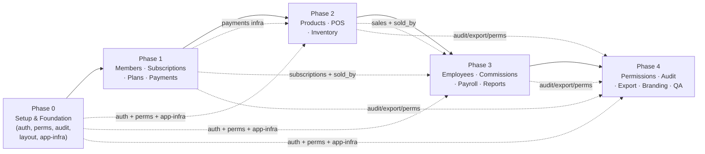
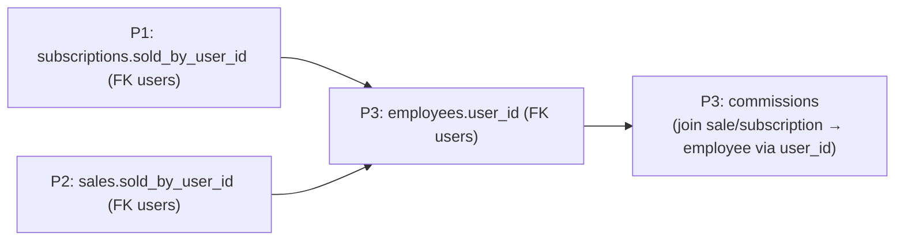
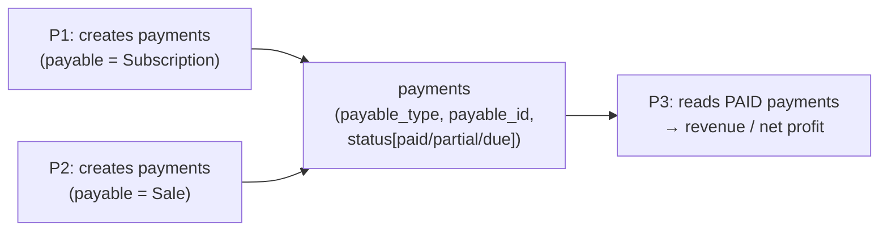
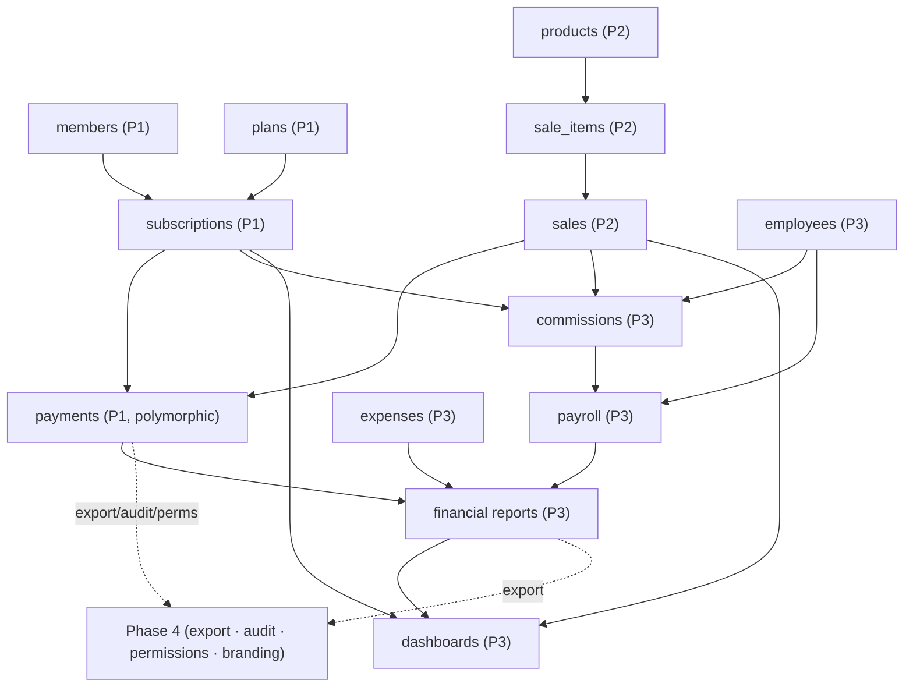

# Phase Connections & Integration Map

**Purpose:** This file is the glue across the five phase documents. It shows the build order, the dependency graph, the exact **produces → consumes** contracts between phases, the cross-cutting concerns, and the two critical integration points.

> Read order: `Phase 0` → `Phase 1` → `Phase 2` → `Phase 3` → `Phase 4` → this file.

---

## 1. How the phases stack
The build is **sequential and incremental**: each phase is self-contained and shippable, while feeding the next.

---

## 2. Produces → Consumes contracts

| Phase | Produces (artifacts/contracts) | Consumed by |
|---|---|---|
| **P0** | Sanctum auth (`auth:sanctum`, `/auth/me` → `permissions[]`), Spatie permission framework, `activity_log`, `settings`, base RTL layout + shared UI, response envelope `{data,meta,message}` + `422` shape, queue/cache/realtime/storage drivers configured | **All phases** |
| **P1** | `members`, `plans`, `subscriptions` (+lifecycle), **`payments` (polymorphic)**, `notifications` + realtime alert pattern, `sold_by_user_id` on subscriptions, dues | **P2** (payments infra, member-linked sales), **P3** (subscriptions → commissions/revenue/KPIs), **P4** (export/audit/perms) |
| **P2** | `products`, `sales`, `sale_items`, `inventory_movements`, sale `payments`, `sold_by_user_id` on sales, receipts | **P3** (sales → commissions/revenue/top-products/performance), **P4** (export/audit/perms) |
| **P3** | `employees` (linked to users), `commissions` (from P1+P2), `payroll`, `expenses`, financial reports, dashboards, performance | **P4** (export payroll/reports, audit, perms, dashboard branding) |
| **P4** | Final permission matrix + role presets, audit-log surfacing, generic export, ATP branding, final security/performance hardening | Wraps **everything** |

---

## 3. The two critical integration points

### 3.1 `sold_by` capture ↔ `employees` link ↔ commissions
A potential circular dependency (sales/subscriptions need a seller; the seller entity comes later). Resolved by a clear contract:

- **P1 & P2** store `sold_by_user_id` referencing **`users`** (which exist from P0) — no forward dependency on `employees`.
- **P3** introduces `employees` with `user_id` and computes commissions by joining the captured `sold_by_user_id` to `employees.user_id`, including a **backfill** command for prior data.

### 3.2 Polymorphic `payments` (one concept, three consumers)

- **P1** defines `payments` once (polymorphic). **P2** reuses it for sales. **P3** reads **paid** payments as the single revenue source. No parallel/forked payment concept.

---

## 4. Cross-cutting concerns (introduced once, extended per phase)

| Concern | Introduced in | Extended in | Finalized in |
|---|---|---|---|
| **Authentication** | P0 | — | — |
| **Permissions** (Spatie) | P0 (framework) | P1 `members.*` · P2 `products/sales.*` · P3 `employees/payroll/reports.*` | **P4** (full matrix + role presets) |
| **Audit log** | P0 (`activity_log`) | P1–P3 add `LogsActivity` to models | **P4** (viewer + filters) |
| **Notifications / Realtime** | P0 (channel) | P1 (renewal reminders) · P2 (new-sale alerts) · P3 (dashboards) | — |
| **Reporting** | — | P2 (sales) · P3 (financial/performance/dashboards) | — |
| **Settings / Branding** | P0 (`settings`) | P1 (`reminder_days`) · P2 (VAT/receipt) | **P4** (Settings UI + ATP identity) |
| **Export** | P0 (packages) | (basic CSV in P2) | **P4** (generic Excel/CSV/PDF everywhere) |
| **Storage** | P0 (disk/R2) | P1 (member photos) · P2 (product images) | — |
| **Performance/indexing** | P0 (conventions) | applied per query in P1–P3 (esp. P3) | **P4** (final index/slow-query pass) |

---

## 5. Entity flow into reporting
How entities created early feed the analytics built later:

---

## 6. Phase handoff checklist (gate between every phase)
Before starting phase N+1, confirm phase N has:
- [ ] All **Acceptance Criteria** in its phase file met.
- [ ] Migrations + seeders merged.
- [ ] Its **permissions** registered (so Phase 4 can consolidate them).
- [ ] Its models emitting **activity-log** entries.
- [ ] Its **integration contracts** (Section 9 of each phase file) verified by the next phase's owner.
- [ ] Test suite passing for the phase's scope.

---

## 7. Dependency risks & how they're mitigated
| Risk | Mitigation |
|---|---|
| Forward dependency on `employees` (needed for `sold_by`) | Capture `sold_by_user_id` (users) in P1/P2; link in P3 via `employees.user_id` + backfill |
| Forked payment logic for sales vs subscriptions | Single polymorphic `payments` defined in P1, reused in P2, read in P3 |
| Permission gaps discovered late | Each phase registers its own permissions; P4 consolidates and audits coverage |
| Heavy report queries hurting DB CPU | JOINs + composite indexes + keyset pagination + Redis-cached dashboards (applied in P3, hardened in P4) |
| Branding/VAT changes forcing code edits | Keep behind `settings`; P4 finalizes via UI, no code change |
